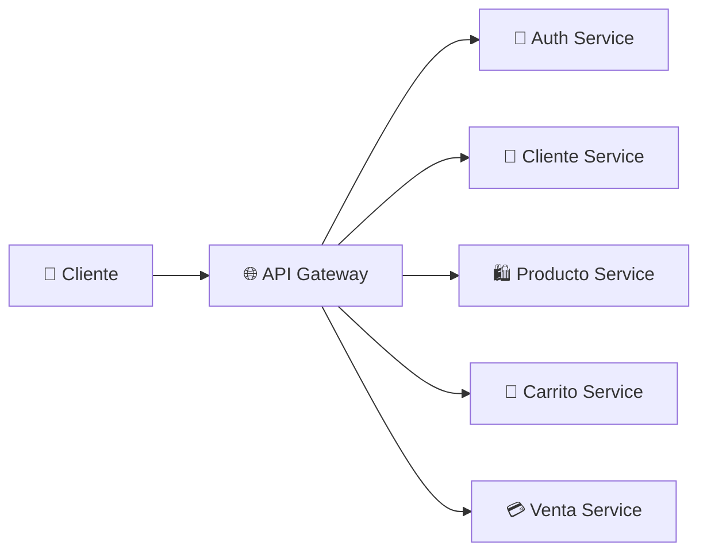
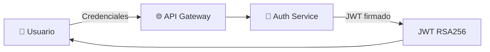
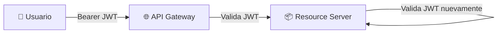

<div align="center">

# 🌐 API Gateway

### Punto único de entrada al ecosistema ElectrodoStore
#### Spring Cloud Gateway · Eureka · LoadBalancer · JWT


</div>

---

API Gateway es el punto único de entrada para todas las solicitudes externas realizadas a ElectrodoStore.

Se encarga de enrutar peticiones hacia los microservicios correspondientes mediante Spring Cloud Gateway, utilizando descubrimiento dinámico con Eureka y balanceo de carga mediante Spring Cloud LoadBalancer.

Además, forma parte de una arquitectura de seguridad basada en JWT y OAuth2 Resource Server.

---

## 🎯 Responsabilidades

- 🌐 Punto único de entrada al sistema
- 🔀 Enrutamiento de solicitudes
- 🔍 Descubrimiento dinámico de servicios
- ⚖️ Balanceo automático de carga
- 🔐 Participación en la arquitectura de seguridad
- 🧩 Desacoplamiento entre clientes externos y microservicios internos

---

## 🧰 Stack tecnológico


---

## 🏗️ Arquitectura



---

## 🗺️ Rutas configuradas

| Ruta | Servicio destino |
| --- | --- |
| `/api/auth/**` | `auth-service` |
| `/api/users/**` | `auth-service` |
| `/api/roles/**` | `auth-service` |
| `/api/permissions/**` | `auth-service` |
| `/api/clientes/**` | `cliente-service` |
| `/api/productos/**` | `producto-service` |
| `/api/carritos/**` | `carrito-service` |
| `/api/ventas/**` | `venta-service` |

---

## 🔁 Estrategia de enrutamiento

Todas las rutas utilizan el filtro `StripPrefix=1`, que elimina el prefijo `/api` antes de reenviar la solicitud al microservicio correspondiente.

<table>
<tr>
<th>📥 Solicitud externa</th>
<th>📤 Solicitud reenviada</th>
</tr>
<tr>
<td>

```http
GET /api/productos
```

</td>
<td>

```http
GET /productos
```

</td>
</tr>
</table>

---

## ⚖️ Balanceo de carga

El Gateway utiliza URIs con el esquema `lb://` para resolver servicios mediante Eureka y distribuir el tráfico automáticamente.

```yaml
uri: lb://producto-service
```

Esto permite:

- 🔍 Resolver servicios mediante Eureka
- ⚖️ Distribuir tráfico entre múltiples instancias
- 🚀 Escalar horizontalmente sin modificar configuraciones

---

## 🔐 Seguridad

API Gateway funciona como **OAuth2 Resource Server** y valida los JWT emitidos por Auth Service antes de reenviar las solicitudes a los microservicios internos.

### Reglas de acceso

| Ruta | Acceso |
| --- | --- |
| `POST /api/auth/**` | 🌐 Público |
| `GET /api/productos` | 🌐 Público |
| `GET /api/productos/{id}` | 🌐 Público |
| Resto de rutas | 🔐 Requiere JWT válido |

### 🔑 Flujo de autenticación



**Proceso:**

1. El usuario envía credenciales al Gateway
2. El Gateway enruta la petición a Auth Service
3. Auth Service valida credenciales y genera el JWT
4. El token es retornado al usuario

### 🛡️ Flujo de acceso a recursos protegidos



**Proceso:**

1. El usuario envía el JWT en el encabezado `Authorization`
2. El Gateway valida el JWT con la clave pública RSA
3. Si es válido, reenvía la solicitud al microservicio destino
4. El Resource Server vuelve a validarlo localmente

> 💡 La doble validación reduce tráfico innecesario y bloquea accesos no autorizados desde el perímetro del sistema.

---

## 🌐 Registro en Eureka

El Gateway se registra en Eureka Server como cualquier otro servicio del ecosistema, permitiendo descubrir dinámicamente las instancias disponibles sin utilizar direcciones IP fijas.

---

## 🔌 Configuración de red

| Propiedad | Valor |
| --- | --- |
| Puerto | `9090` |
| Acceso | ✅ Público |

---

## ▶️ Ejecución local

> ⚠️ Requiere que Config Server y Eureka Server estén ejecutándose previamente.

### Maven

```bash
mvn spring-boot:run
```

### Docker

```bash
docker build -t api-gateway .
```

---

## 💡 Decisiones de diseño

<details>
<summary><b>🌐 Punto único de entrada</b></summary>
<br>
Todos los consumidores externos interactúan exclusivamente con el Gateway, evitando acceso directo a los microservicios internos.
</details>

<details>
<summary><b>🔍 Descubrimiento dinámico</b></summary>
<br>
Los servicios se resuelven mediante Eureka utilizando identificadores lógicos en lugar de direcciones IP fijas.
</details>

<details>
<summary><b>⚖️ Balanceo transparente</b></summary>
<br>
Spring Cloud LoadBalancer distribuye automáticamente el tráfico entre instancias disponibles.
</details>

<details>
<summary><b>🧩 Desacoplamiento de clientes externos</b></summary>
<br>
La estructura interna de la arquitectura permanece oculta para los consumidores del sistema.
</details>

<details>
<summary><b>🔐 Integración con JWT</b></summary>
<br>
La arquitectura permite propagar el contexto de seguridad entre servicios mediante tokens JWT emitidos por Auth Service.
</details>

<details>
<summary><b>🛡️ Validación temprana de JWT</b></summary>
<br>
El Gateway valida los JWT antes de reenviar las solicitudes a los microservicios internos, reduciendo tráfico innecesario y bloqueando accesos no autorizados desde el perímetro del sistema.
</details>

---

## 🚀 Mejoras futuras

| Mejora | Descripción |
| --- | --- |
| 🚦 **Rate Limiting** | Control de tráfico por usuario o cliente |
| 📡 **Observabilidad** | Integración con OpenTelemetry y Zipkin |
| 📝 **Logging centralizado** | Registro unificado de solicitudes |
| 🛡️ **Filtros globales** | Headers de seguridad y trazabilidad |
| 📊 **Métricas** | Monitoreo de rendimiento y consumo |
